> *For the graduates. Bring a bigger machine.*

---

## This is the sequel.

[AI-Trainer-MAX](https://github.com/thebardchat/AI-Trainer-MAX) teaches a Windows user with no prior experience how to install, run, and own a local AI — all the way through to building a digital legacy their family can still run after they're gone.

**OBLIVION is what comes after that.**

It is the research-math layer MAX deliberately left out. The part where the training wheels come off and you stop being a user of models and start being someone who shapes them.

It is not for beginners. It is not hand-holding.
It assumes you finished MAX and want more.

---

## What it will cover

No release date yet. This is the planned arc.

- **Fine-tuning on your own hardware** — the actual mechanics, not hand-waving
- **LoRA / QLoRA on consumer GPUs** — 8GB, 12GB, 24GB reality
- **Quantization trade-offs** — GGUF, Q4 / Q5 / Q8, when each wins
- **Custom Modelfiles at depth** — system prompts as architecture, not cosmetics
- **Training-data curation** — how to build the set that matters
- **Synthetic data generation pipelines** — making your own, ethically
- **Eval harnesses** — measuring "better" instead of feeling it
- **Prompt-to-weights reasoning** — what a gradient actually does
- **Embedding-space geometry** — how retrieval really works
- **Running your fine-tune in production** — the part nobody documents

---

## Prerequisites

- Completed all 5 phases of [AI-Trainer-MAX](https://github.com/thebardchat/AI-Trainer-MAX)
- A machine with more than 16GB of RAM and preferably a GPU
- Comfort with the command line
- Patience. Runs will fail. That's part of the course.

If you haven't finished MAX, **finish MAX first.** OBLIVION will still be here.

---

## When

No promised date. Shipped when it's ready, not before.

**To know when it opens:**

- ⭐ Star this repo
- 👀 Watch this repo for releases
- Follow [@thebardchat](https://github.com/thebardchat)

---

## Where this fits

```
ShaneBrain         (local · private)
  └── AI-Trainer-MAX         ← START HERE · foundation
        └── AI-Trainer-OBLIVION   ← YOU ARE HERE · depth
              └── Angel Cloud      (public · families)
                    └── Pulsar AI     (enterprise · secure)
                          └── TheirNameBrain  (legacy · generational)
```

Part of the [ShaneBrain Ecosystem](https://github.com/thebardchat).
Governed by the [thebardchat Constitution](https://github.com/thebardchat/constitution).

---

## Contact

If you have research to contribute, hardware questions, or want early-access to alpha modules when they drop, open an issue.

If you're here because someone sent you and you haven't done MAX yet, [that's where to start](https://github.com/thebardchat/AI-Trainer-MAX).

---

*"Your legacy runs local."*

Built in Alabama. Built for everyone who's ready for the next step.


https://github.com/thebardchat/constitution
